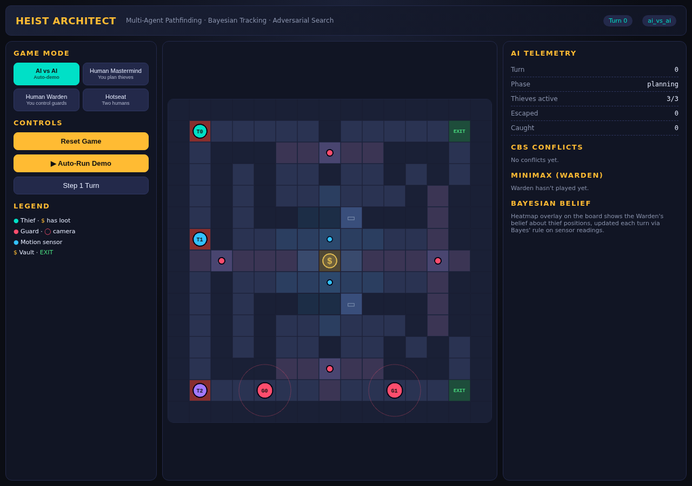

# Heist Architect

**Multi-Agent Pathfinding Strategy Game**  — an interactive demonstrator for four
classical AI techniques: A*, Conflict-Based Search (CBS), Bayesian belief
tracking, and Minimax search with α–β pruning.

> A two-player asymmetric game: the **Mastermind** plans coordinated paths for
> three thieves through a guarded building, while the **Warden** uses sensors
> and guards to detect and intercept them.



---

## 1. Features

- **15×15 guarded building** with walls, doors, a vault, two exits, 4 cameras
  (line-of-sight cones) and 2 motion sensors
- **3 thieves vs 2 guards**, turn-based execution
- **Four game modes:**
  - `AI vs AI` — auto-demo (streams over WebSocket)
  - `Human Mastermind` — you pick goals, CBS plans conflict-free paths
  - `Human Warden` — you control the guards
  - `Hotseat` — two humans, one screen
- **Visualised AI internals:**
  - A* expanded nodes + yellow path preview as you plan
  - CBS conflict markers (red ✕) on the board
  - Bayesian belief heat-map (Warden's view of thief probability)
  - Minimax candidate-move list with chosen action highlighted
  - Camera cones, motion-sensor radii and live sensor trigger flashes

---

## 2. Architecture

```
┌─────────────────────────┐      WebSocket /ws      ┌──────────────────────────┐
│   React + Phaser 3      │◀──── JSON turn stream ──│   FastAPI + uvicorn      │
│  (Vite dev server)      │                         │    (Python 3.10)         │
│                         │── REST /api/* ─────────▶│                          │
│  • MainScene renderer   │                         │  • GameState engine      │
│  • HUD / control panel  │                         │  • A*  (space-time)      │
│  • AI telemetry panel   │                         │  • CBS  (conflict tree)  │
└─────────────────────────┘                         │  • BayesTracker (numpy)  │
                                                    │  • Minimax + α-β         │
                                                    └──────────────────────────┘
```

See [docs/ARCHITECTURE.md](docs/ARCHITECTURE.md) for the full diagram and data
flow.

---

## 3. AI techniques

### 3.1 A* with time-indexed constraints — [astar.py](backend/app/ai/astar.py)

State is `(cell, t)`. At every step the agent can move to a 4-neighbour or
**wait**. CBS passes in two kinds of constraints that the low-level A* must
respect:

- `("vertex", agent, cell, t)` — must not be at `cell` at time `t`
- `("edge",   agent, a, b, t)` — must not traverse `a → b` between t and t+1

The Manhattan heuristic is admissible on a 4-connected grid, so A* returns
optimal paths.

### 3.2 Conflict-Based Search (CBS) — [cbs.py](backend/app/ai/cbs.py)

Two-level multi-agent planner:

1. **Root node:** plan every thief independently with A*.
2. Scan the joint solution for the earliest **vertex** (same cell, same t) or
   **edge** (swap) conflict.
3. **Branch** on that conflict: create two children, each adding one of the
   two conflict-resolving constraints to one of the involved agents.
4. Re-plan that agent's path via A* under the new constraint set.
5. Use total path length as the `f`-value and continue best-first until a
   conflict-free joint solution is found.

Conflicts encountered are surfaced to the UI so you can *see* CBS debate.

### 3.3 Bayesian belief tracker — [bayes.py](backend/app/ai/bayes.py)

Each thief has its own probability grid `P(cell)` over the 15×15 board
(numpy). Every turn:

1. **Predict** — propagate probability to walkable neighbours (+ stay), i.e.
   a uniform motion model: $P'(c') = \sum_{c \in N(c')} \tfrac{P(c)}{|N(c)|+1}$
2. **Update** — apply Bayes' rule using each sensor reading:
   $$P(c \mid o) \propto P(o \mid c)\, P(c)$$
   Cameras and motion sensors use a coverage mask with `detect_prob` inside
   and `false_pos` outside. Guards in line-of-sight collapse the belief to a
   Dirac spike.

The aggregate heat-map (per-cell max over thieves) is sent to the UI as the
Warden's "best guess". Total Shannon entropy is available for Minimax scoring.

### 3.4 Minimax Warden AI — [minimax.py](backend/app/ai/minimax.py)

Depth-2 search (guard ply → thief ply) with α–β pruning and a small branching
cap. At each Warden ply we enumerate joint guard moves; at each thief ply we
simulate one probability diffusion step as a pessimistic thief response.

The heuristic rewards:
- proximity of each guard to the top-k high-belief cells
- coverage bonus when guards are inside their 3-cell vision of those cells

The candidate actions & chosen move are exposed to the UI for inspection.

---

## 4. Running it

### Backend

```bash
python3 -m venv .venv
.venv/bin/pip install -r backend/requirements.txt
PYTHONPATH=backend .venv/bin/uvicorn app.main:app --port 8000 --reload
```

### Frontend

```bash
cd frontend
npm install
npm run dev     # http://localhost:5173
```

Vite proxies `/api` and `/ws` to the backend on port 8000, so the app is
reachable at a single URL.

### Quick demo flow

1. Open http://localhost:5173
2. Leave the mode on **AI vs AI** and click **▶ Auto-Run Demo**.
3. Watch thieves coordinate through the vault, the Bayesian heat-map light up
   around sensor triggers, and Minimax moves the guards toward the peaks.

---

## 5. Repository layout

```
backend/
  app/
    main.py              # FastAPI + WebSocket
    game/
      grid.py            # 15x15 map, tiles, cameras, sensors
      state.py           # turn engine, game rules
    ai/
      astar.py           # space-time A*
      cbs.py             # Conflict-Based Search
      bayes.py           # Bayesian belief tracker
      minimax.py         # α-β Warden AI
  tests/smoke.py         # quick algorithm smoke test
frontend/
  src/
    App.jsx              # UI shell + mode router
    api.js               # REST + WebSocket client
    game/
      MainScene.js       # Phaser scene (all layers)
      PhaserGame.jsx     # React wrapper
  vite.config.js         # proxies /api and /ws
docs/
  ARCHITECTURE.md
  REPORT.md              # course submission text
```

---

## 6. Course submission

- Proposal: `Heist Architect - Project Proposal (1).pdf`
- Final report: [docs/REPORT.md](docs/REPORT.md)
- Architecture / data-flow: [docs/ARCHITECTURE.md](docs/ARCHITECTURE.md)

## 7. LinkedIn post template

See [docs/LINKEDIN.md](docs/LINKEDIN.md) for a ready-to-paste post plus a
scripted 30-second capture sequence for the demo GIF/MP4.
