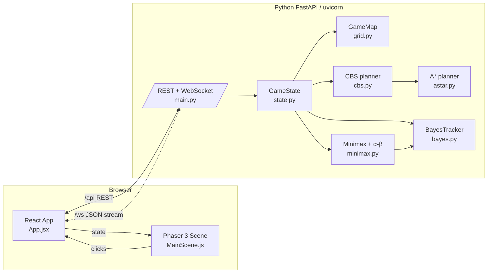
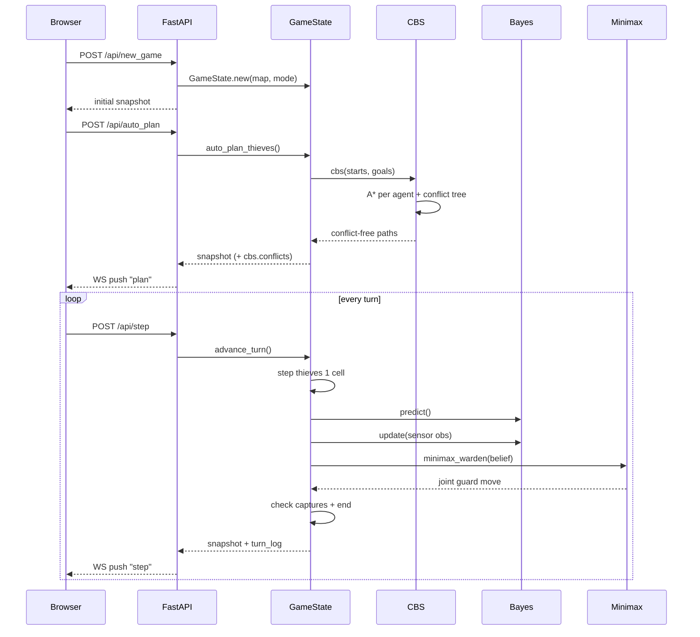

# Architecture

## System diagram

## Turn data flow

## Data model

| Concept       | Source                                               |
|---------------|------------------------------------------------------|
| Map           | `backend/app/game/grid.py` — `GameMap`, tiles, cams |
| Thief / Guard | `backend/app/game/state.py`                         |
| Path          | list of `(row, col)`; index = timestep              |
| Constraint    | tagged tuple: `("vertex", a, cell, t)` / `("edge", a, ca, cb, t)` |
| Belief        | dict[thief_id, np.ndarray(rows, cols)]              |

## Key design choices

1. **Distinct goals per agent.** CBS cannot settle two agents on the same
   terminal cell. We use a *vault zone* (vault + its neighbours) so three
   thieves get distinct approach cells; touching any zone cell grants loot.
2. **Space-time A* with wait.** Each state is `(cell, t)` with an allowed
   wait action; this lets CBS resolve head-on collisions without teleporting.
3. **Independent per-thief Bayes grids.** Keeping thieves' belief distributions
   independent loses mutual-exclusion information but keeps the model O(rows·cols)
   per thief instead of exponential.
4. **Minimax against a diffusion adversary.** Because the Warden doesn't know
   true thief positions, the opponent ply is modelled as one probability
   diffusion step and the Warden chooses the minimum of {current, diffused}
   scores — inexpensive but still adversarial.
